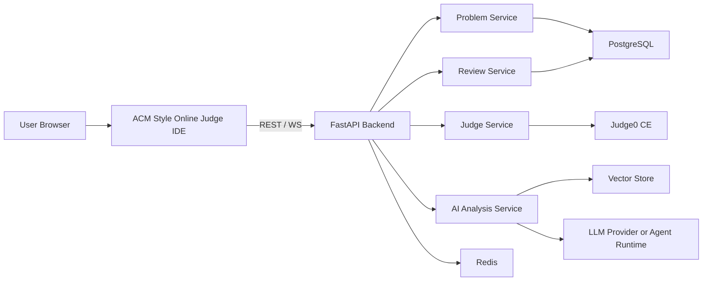

# ByteHunter v2 MVP

Feature Name: bytehunter-v2-mvp
Updated: 2026-06-23

## Description

ByteHunter v2 MVP 采用前后端分离架构，围绕手工录题的算法题库、ACM 模式在线判题 IDE、AI 解题分析、AI 错误归因和错题复盘构建训练闭环。MVP 的目标是以最小可用范围验证“题目训练效率提升”和“错题复盘效率提升”两个核心价值。

## Architecture



### Architecture Notes

- 前端负责题面展示、代码编辑、提交执行、流式 AI 展示和历史复盘。
- FastAPI 作为统一入口，承接同步接口和流式接口。
- Judge Service 负责与 Judge0 交互，并把外部判题结果转为统一 Verdict。
- AI Analysis Service 负责解题分析、错误归因和后续变式题流程。
- Review Service 负责按题目、公司、标签和错误类型组织复盘数据。
- 题库首版采用手工录入，批量导入能力通过统一的数据模型预留。

## Components and Interfaces

### ACM Style Online Judge IDE

职责：

- 展示题库列表和题目详情。
- 集成 Monaco Editor，作为 ACM 模式在线判题 IDE 的编辑核心，支持 Python、C++、Java 模板切换。
- 展示判题过程、Verdict、运行指标、失败样例差异和 AI 面板。

主要接口：

- `GET /api/v1/problems`
- `GET /api/v1/problems/{problem_id}`
- `POST /api/v1/submissions`
- `GET /api/v1/submissions/{submission_id}`
- `POST /api/v1/analysis/solution`
- `POST /api/v1/analysis/attribution`
- `GET /api/v1/review`
- `WS /ws/analysis/{problem_id}`

## UI Style Direction

### Design Goals

- 界面气质应接近专业训练工作台，而不是内容社区首页。
- 页面信息密度要高，但视觉上要留白，保证算法训练时的专注感。
- 布局优先采用传统后台工作台结构，左侧只保留全局导航，业务筛选统一放在内容区顶部，减少横向切割。

### Visual Language

- 整体风格采用白底专业工作台界面，主背景和主面板保持明亮通透，通过描边和轻层次区分结构。
- 主色建议使用清晰的蓝色体系作为交互高亮，状态色单独承担判题反馈语义。
- 字体建议采用 `IBM Plex Sans` 作为界面字体，`JetBrains Mono` 作为代码和数据字体，形成训练工具的专业感。
- 容器边界以细描边、浅阴影、分隔线和背景层差为主，减少厚重卡片边框。

### Layout Principles

- 全局布局采用“左侧主菜单 + 顶部页面工具区 + 中部主内容区”结构。
- 题目清单优先采用表格化列表或紧凑行块，而不是瀑布式卡片矩阵。
- 做题页采用“双区工作台”结构：主区域承载题面与编辑器切换，侧边区承载判题与 AI 面板。
- 页面避免同时出现四个纵向分栏，侧边信息通过抽屉、标签页和折叠面板承载。
- 顶部保留统一窄工具栏，承载题目标题、语言切换、运行、提交和训练状态。

### Key Screens

#### Problem Library

- 页面左侧只保留全局导航菜单，例如题库、训练、复盘、设置。
- 内容区顶部放置搜索、公司、部门、难度、标签、状态等筛选与排序控件。
- 主体区域使用传统数据表格，每行展示标题、公司、部门、难度、标签、最近状态和进入训练动作。

#### Problem Workspace

- 主区域采用上下或标签切换方式组织 `题面` 与 `代码`，让 Monaco 在进入编码状态后占据视觉中心。
- 输入输出区挂接在编辑器下方或底部抽屉，避免新增独立纵列。
- 右侧为固定宽度的判题与 AI 工作区，使用标签页切换 `Result`、`Explain`、`Review`，减少同时出现的杂乱信息。
- Verdict、时间、内存使用横向状态条展示，失败样例采用 diff 区块展示。
- `Run` 用于自测运行并展示多测点结果，`Submit` 用于正式判题并生成提交记录。

#### Review View

- 复盘页延续“左侧主菜单 + 顶部筛选 + 中部列表/时间线 + 详情抽屉”结构。
- 错误归因优先用标签、时间线和统计条，而不是大量独立卡片。

### Component Rules

- 卡片只用于少量高价值摘要模块，例如首页训练概览和最近错题摘要。
- 大多数业务内容使用表格、列表、分段面板、标签页和抽屉承载。
- 标签颜色控制在有限集合内，避免页面被多彩徽标打散。
- 动效以面板展开、状态切换和流式输出渐进显示为主，避免装饰性过强的浮动动画。

### Responsive Strategy

- 桌面端优先保证左侧主菜单加主内容区的传统后台结构。
- 平板端切换为顶部导航加抽屉侧栏结构。
- 手机端采用“题面 / 编辑器 / AI”分段切换视图，顶部保留核心操作按钮。

### Interaction Notes

- `Run` 与 `Submit` 必须在视觉上形成主次层级，避免误触正式提交。
- AI 返回的行号高亮需要直接映射到编辑器内联提示和侧边标记。
- 判题结果出现后，焦点优先落在 Verdict 条和首个失败信息区。
- 复盘入口应常驻于做题页右侧工作区，形成提交后立即复盘的连续动作。
- WA 场景下，底部抽屉与右侧结果区都应提供 stdout 与 expected 的 diff 入口。
- RE 场景下，右侧结果区应优先展示 stderr 或堆栈片段，并允许跳转到 AI 归因面板。

### Wireframe Notes

#### Problem Library Wireframe

```text
+----------------------------------------------------------------------------------+
| Top Bar: Logo | Current Page | Search | User Menu                               |
+----------------------+-----------------------------------------------------------+
| Left Main Menu       | Page Header: Problem Library                              |
| - 题库               | Filter Row: Company | Department | Difficulty | Tag | ... |
| - 训练               | Toolbar: Sort | Status | Reset | Batch Actions            |
| - 复盘               +-----------------------------------------------------------+
| - 设置               | Problem Table                                             |
|                      | Title | Company | Department | Difficulty | Tags | Status |
|                      | --------------------------------------------------------- |
|                      | ... rows ...                                              |
|                      | --------------------------------------------------------- |
|                      | Pagination                                                 |
+----------------------+-----------------------------------------------------------+
```

- 左侧主菜单宽度建议固定在 `220px` 到 `240px`。
- 顶部筛选行建议分成两层，第一层放高频筛选，第二层放排序和批量操作。
- 表格区占据页面主体宽度，单行高度保持紧凑，减少视觉跳跃。

#### Problem Workspace Wireframe

```text
+----------------------------------------------------------------------------------+
| Top Bar: Back | Problem Title | Language Switch | Run | Submit | Training State   |
+----------------------+-----------------------------------------------------------+
| Left Main Menu       | Main Workspace                                            |
| - 题库               | Tabs: 题面 | 代码 | 提交记录                                 |
| - 训练               | --------------------------------------------------------- |
| - 复盘               | Active Panel                                              |
| - 设置               | [Problem Statement or Monaco Editor]                      |
|                      |                                                           |
|                      | Bottom Drawer: Custom Input | Output | Failed Case Diff   |
+----------------------+-----------------------------------------+-----------------+
|                      |                                         | Right Workbench |
|                      |                                         | Tabs: Result    |
|                      |                                         | Explain | Review |
|                      |                                         | Status Bar      |
|                      |                                         | Detail Content  |
+----------------------+-----------------------------------------+-----------------+
```

- 左侧主菜单保持全局一致，避免页面切换时结构跳变。
- 主工作区建议占 `minmax(0, 1fr)`，右侧工作区建议固定在 `360px` 到 `420px`。
- `题面` 与 `代码` 采用标签切换或上下分段模式，首版优先标签切换，保证编码时编辑器宽度。
- 自定义输入、运行输出和失败样例差异挂在底部抽屉，默认收起，运行后自动展开到相关标签。

#### Review View Wireframe

```text
+----------------------------------------------------------------------------------+
| Top Bar: Logo | Current Page | Quick Search | User Menu                          |
+----------------------+-----------------------------------------------------------+
| Left Main Menu       | Page Header: Review Center                                |
| - 题库               | Filter Row: Wrong Only | Company | Tag | Error Type | ... |
| - 训练               | Summary Strip: Wrong Count | Recent AC | Main Weakness     |
| - 复盘               +-----------------------------------------------------------+
| - 设置               | Review List / Timeline                                    |
|                      | Problem | Last Verdict | Error Type | Last Practice | ... |
|                      | --------------------------------------------------------- |
|                      | ... rows ...                                              |
|                      | --------------------------------------------------------- |
|                      | Detail Drawer / Side Panel                                |
+----------------------+-----------------------------------------------------------+
```

- 复盘页主体仍以列表为主，详情通过右侧抽屉或侧滑面板展开。
- 顶部摘要条只保留少量关键指标，避免演变成第二层卡片瀑布。

### Component Inventory

#### Global Shell Components

- `AppFrame`: 承载左侧主菜单、顶部栏和页面内容区。
- `MainSidebar`: 提供题库、训练、复盘、设置导航和当前页高亮。
- `TopHeader`: 提供页面标题、全局搜索、用户菜单和上下文操作入口。
- `StatusBadge`: 统一展示题目状态、判题状态和训练状态。
- `FilterBar`: 统一承载搜索框、下拉筛选、标签筛选和重置操作。

#### Problem Library Components

- `ProblemLibraryHeader`: 展示页面标题、题量摘要和快捷操作。
- `ProblemFilterToolbar`: 承载公司、部门、难度、标签、状态和排序控件。
- `ProblemTable`: 传统表格主体，负责列宽、排序和行点击。
- `ProblemTableRow`: 展示单题标题、公司、部门、难度、标签、最近状态和进入训练按钮。
- `ProblemPagination`: 承载分页、每页数量和总数信息。
- `ProblemEmptyState`: 处理无结果和无题目两类空状态。

#### Problem Workspace Components

- `WorkspaceHeader`: 展示返回、题目标题、语言切换、`Run`、`Submit` 和训练状态。
- `WorkspaceTabs`: 管理 `题面`、`代码`、`提交记录` 三个主标签。
- `ProblemStatementPanel`: 渲染题面、输入输出说明、样例和约束。
- `EditorPanel`: 封装 Monaco Editor、语言模板切换和代码草稿状态。
- `ConsoleDrawer`: 承载 `Custom Input`、`Output`、`Failed Case Diff`。
- `RightWorkbench`: 右侧固定工作区容器。
- `ResultPanel`: 展示 Verdict、运行时间、内存、编译错误、RE 堆栈和失败详情。
- `ExplainPanel`: 展示 AI 解题分析、RE 归因和流式返回内容。
- `ReviewPanel`: 展示最近提交、错误归因摘要和再次训练入口。
- `RunCaseList`: 展示 `Run` 模式下的多测点结果。
- `DiffViewerPanel`: 基于 Monaco DiffEditor 展示 stdout 与 expected 的对比。
- `EditorDiagnosticOverlay`: 基于 Monaco gutter 标记和 hover 解释展示 AI 行高亮诊断。

#### Review View Components

- `ReviewHeader`: 展示复盘页标题和摘要信息。
- `ReviewFilterToolbar`: 承载错题筛选、公司、标签、错误类型和时间范围。
- `ReviewSummaryStrip`: 展示错题总数、最近 AC、主要薄弱点等轻量指标。
- `ReviewList`: 以列表或时间线形式展示复盘项。
- `ReviewListRow`: 展示题目、最近 Verdict、错误类型、最近练习时间和查看详情动作。
- `ReviewDetailDrawer`: 展示提交历史、错误归因、建议和再次训练动作。

### Page States

#### Problem Library States

- `loading`: 首次加载题库数据，表格区域显示骨架屏。
- `ready`: 正常展示筛选条、表格和分页。
- `empty`: 当前筛选条件下无结果，展示空状态和重置筛选按钮。
- `error`: 题库请求失败，展示重试入口和错误说明。

#### Problem Workspace States

- `reading`: 默认阅读题面状态，主标签停留在 `题面`。
- `coding`: 进入编码状态，`代码` 标签激活，编辑器占据主视觉区域。
- `running`: 执行 `Run` 后显示运行中状态，禁用重复触发按钮。
- `submitting`: 执行 `Submit` 后显示正式判题中状态。
- `judged`: 收到 Verdict 后，右侧 `Result` 标签自动获得焦点。
- `run_ready`: 自测完成后展示多测点结果，并允许进入 diff 或错误分析。
- `diff_open`: WA 失败后打开 diff 面板，展示 stdout 与 expected 的逐行差异。
- `runtime_diagnosing`: RE 场景下 AI 归因正在读取 stderr 并生成解释。
- `analysis_streaming`: AI 返回流式内容时，右侧 `Explain` 标签展示增量输出。
- `analysis_ready`: AI 分析完成，支持行号高亮和建议跳转。
- `error`: 判题或 AI 请求失败，保留现有代码和最近结果，展示重试入口。

#### Review View States

- `loading`: 复盘列表和摘要同时加载。
- `ready`: 正常展示筛选、摘要和复盘列表。
- `drawer_open`: 用户打开某条复盘记录详情抽屉。
- `empty`: 当前条件下无复盘记录。
- `error`: 复盘数据加载失败，展示错误信息和重试按钮。

### Interaction Priority

1. 题库页优先保障“筛选 -> 浏览 -> 进入训练”三步路径顺畅。
2. 做题页优先保障“切语言 -> 写代码 -> Run -> Submit -> 看结果 -> 看 AI”主链路顺畅。
3. 复盘页优先保障“筛选错题 -> 查看原因 -> 再次训练”闭环顺畅。

### Design Tokens

#### Color Tokens

- `--bg-app: #ffffff` 用于全局应用背景。
- `--bg-surface: #ffffff` 用于主内容区背景。
- `--bg-panel: #ffffff` 用于表格、抽屉、侧边工作区。
- `--bg-subtle: #f6f8fb` 用于筛选区、表头和轻量摘要条。
- `--border-default: #d7dde7` 用于常规边框和分隔线。
- `--border-strong: #bcc6d4` 用于激活状态和重点区块边界。
- `--text-primary: #152033` 用于主标题和正文。
- `--text-secondary: #526075` 用于次级信息。
- `--text-muted: #7d8796` 用于辅助说明和占位文本。
- `--accent-primary: #2563eb` 用于主按钮、导航激活和关键链接。
- `--accent-soft: #dbeafe` 用于主色浅背景。
- `--accent-active: #1d4ed8` 用于 hover 和激活态补充强调。

#### Verdict Tokens

- `--verdict-ac: #1f7a4f`
- `--verdict-wa: #c27a1a`
- `--verdict-tle: #b65a2a`
- `--verdict-re: #b23a48`
- `--verdict-ce: #6b59b3`
- Verdict 标签背景统一使用对应颜色的 10% 到 14% 浅底色，文字和图标使用对应主色。

#### Typography Tokens

- `--font-sans: "IBM Plex Sans", "PingFang SC", "Microsoft YaHei", sans-serif`
- `--font-mono: "JetBrains Mono", "SFMono-Regular", monospace`
- `--text-xs: 12px`
- `--text-sm: 13px`
- `--text-md: 14px`
- `--text-lg: 16px`
- `--text-xl: 20px`
- `--text-2xl: 26px`
- 页面正文默认使用 `14px`，表格和辅助标签优先使用 `13px`，页面标题使用 `20px` 到 `26px`。

#### Spacing Tokens

- `--space-1: 4px`
- `--space-2: 8px`
- `--space-3: 12px`
- `--space-4: 16px`
- `--space-5: 20px`
- `--space-6: 24px`
- `--space-8: 32px`
- 页面主内容区建议内边距使用 `24px`。
- 筛选条、表格、侧边工作区内部建议内边距使用 `16px` 到 `20px`。

#### Radius And Shadow Tokens

- `--radius-sm: 8px`
- `--radius-md: 12px`
- `--radius-lg: 16px`
- `--shadow-sm: 0 1px 2px rgba(15, 23, 42, 0.05)`
- `--shadow-md: 0 8px 24px rgba(15, 23, 42, 0.08)`
- 主页面面板以 `12px` 圆角和轻阴影为默认组合，避免厚重悬浮感。

#### Layout Tokens

- `--sidebar-width: 232px`
- `--header-height: 60px`
- `--filterbar-height: 52px`
- `--workbench-width: 392px`
- `--table-row-height: 44px`
- `--drawer-height: 200px`
- `--diff-panel-min-height: 220px`
- 题库表头高度建议 `44px`，工作台顶部工具栏高度建议 `56px` 到 `60px`。

#### Motion Tokens

- `--motion-fast: 120ms ease`
- `--motion-base: 180ms ease`
- `--motion-slow: 240ms ease`
- 交互动效主要用于标签切换、抽屉展开、行 hover 和 AI 流式渐进显示。

### Surface Behavior Rules

#### Filter Bar Rules

- 筛选条使用 `--bg-subtle` 作为底色，外边框使用 `--border-default`，保持白底页面中的轻层次感。
- 单个筛选控件优先使用白底输入框或白底下拉框，避免整条筛选区继续叠加深色块。
- 高频操作从左到右排列为 `搜索 -> 核心筛选 -> 排序 -> 重置`，减少视线跳跃。

#### Table Rules

- 题库表格和复盘表格均使用白底表面，表头使用 `--bg-subtle` 区分。
- 行 hover 使用极浅蓝底，建议基于 `--accent-soft` 再降低一档透明度。
- 当前选中行通过左侧 3px 到 4px 的强调色竖条和轻底色区分，避免整行重色填充。
- 表格列内容优先左对齐，状态列和操作列保留固定宽度，减少跳动。

#### Button Hierarchy Rules

- `Submit` 使用 `--accent-primary` 实心主按钮，作为页面最强操作。
- `Run` 使用白底描边按钮，边框使用 `--border-strong`，文字使用 `--text-primary`。
- `Reset`、`Retry`、`More` 等次级操作使用文字按钮或轻描边按钮。
- 同一区域内最多保留一个高强调实心按钮，避免页面出现多主按钮竞争。

#### Right Workbench Rules

- 右侧工作区保持白底，依靠左边界分隔线和内部标签页形成结构，不额外使用深底色。
- `Result`、`Explain`、`Review` 标签激活态使用浅蓝底和蓝色文字，未激活态保持白底。
- Verdict 条优先贴近工作区顶部，第一时间反馈结果。
- AI 流式内容区域保持长文阅读样式，段落间距明确，避免看起来像聊天气泡堆叠。
- RE 场景下，工作区顶部应展示 stderr 摘要卡片和 `AI 归因` 快捷动作。

#### Drawer Rules

- 底部抽屉默认白底，顶部带细分隔线和标签导航。
- `Output` 和 `Failed Case Diff` 区域内部使用等宽字体和浅灰背景代码块，增强可读性。
- 抽屉展开时覆盖主区下沿，保持右侧工作区位置稳定，减少布局抖动。
- `Failed Case Diff` 优先使用 Monaco DiffEditor，至少保留 `stdout` 与 `expected` 两栏可见。

#### Sidebar Rules

- 左侧主菜单使用白底或极浅底色，与主内容区之间通过垂直分隔线区分。
- 当前菜单项通过浅蓝底、蓝色文字和中等字重高亮，避免厚重按钮化。
- 菜单图标保持单色线性风格，避免彩色图标打散页面统一性。

### Frontend Implementation Mapping

#### Tailwind Theme Mapping

- 在全局主题中把 `background`、`card`、`popover` 统一映射到白底体系。
- `primary` 使用 `--accent-primary`，`primary-foreground` 使用白色。
- `muted` 和 `secondary` 使用 `--bg-subtle` 及其对应文字色，避免生成偏灰暗按钮。
- `border`、`input`、`ring` 统一映射到 `--border-default`、`--border-strong` 和 `--accent-primary`。

#### Shadcn Component Usage Rules

- `Table` 用于题库页和复盘页主列表，避免用 `Card` 包一层再包 `Table`。
- `Tabs` 用于做题页主区切换和右侧工作区切换。
- `Sheet` 或 `Drawer` 用于复盘详情抽屉和移动端侧栏。
- `Select`、`Input`、`Button`、`Badge` 作为筛选条和状态系统的基础控件。
- `Card` 仅允许用于少量摘要信息区，例如复盘摘要条中的单个概览模块。

#### Layout Class Guidance

- 外层应用框架建议使用 `grid`，列结构为 `sidebar + main`。
- 题库页主内容建议使用 `flex flex-col gap-4` 组织标题区、筛选区和表格区。
- 做题页主内容建议使用 `grid` 或 `flex` 实现 `main + aside`，右侧工作区宽度固定。
- 底部抽屉建议使用 `border-t bg-white` 结构，避免重阴影弹层效果。

#### Styling Anti-Patterns

- 避免在白底页面中引入大面积深灰背景块。
- 避免为每个模块单独套一层大圆角卡片。
- 避免使用渐变主按钮、彩色阴影和过多玻璃态效果。
- 避免把 AI 面板实现成连续聊天气泡流，优先使用分析文档样式。
- 避免把 WA diff 降级成纯文本拼接，优先使用结构化 diff 视图。

#### First Implementation Order

1. 先实现 `AppFrame`、`MainSidebar`、`TopHeader` 和全局 token 注入。
2. 再实现题库页的 `FilterBar + ProblemTable`。
3. 然后实现做题页的 `WorkspaceHeader + EditorPanel + RightWorkbench + ConsoleDrawer`。
4. 最后实现复盘页的 `ReviewFilterToolbar + ReviewList + ReviewDetailDrawer`。

### Problem Service

职责：

- 管理手工录题数据。
- 支持题库筛选、题目详情和未来批量导入兼容字段。

核心接口：

- `create_problem(payload)`
- `list_problems(filters)`
- `get_problem(problem_id)`

### Judge Service

职责：

- 接收语言、代码、测试集和输入输出要求。
- 调用 Judge0 执行编译和运行。
- 归一化外部状态码，输出平台统一 Verdict。
- 区分 `Run` 自测流程与 `Submit` 正式判题流程，并保留多测点结果。

核心接口：

- `submit_for_judge(payload)`
- `poll_judge_result(token)`
- `normalize_verdict(result)`
- `run_visible_cases(payload)`

### AI Analysis Service

职责：

- 生成解题分析。
- 生成错误归因和修改建议。
- 预留题目变形与相似题推荐能力。
- 在 RE 场景下结合 stderr 或堆栈片段生成归因结果和行级解释。

核心接口：

- `analyze_solution(problem, user_context)`
- `attribute_error(problem, submission, judge_result)`
- `recommend_next_practice(problem, review_context)`
- `map_editor_diagnostics(attribution)`

### Review Service

职责：

- 聚合提交记录。
- 输出错题本和错误类型分布。
- 为重复训练提供最近历史上下文。

核心接口：

- `record_submission(submission)`
- `attach_attribution(submission_id, attribution)`
- `list_review_items(filters)`

## Data Models

### Problem

```text
Problem
- id
- title
- company
- department
- difficulty
- statement_markdown
- constraints_text
- examples_json
- tags_json
- supported_languages_json
- starter_templates_json
- source_type
- source_ref
- external_id
- status
- created_at
- updated_at
```

### ProblemTestCase

```text
ProblemTestCase
- id
- problem_id
- case_type
- stdin_text
- expected_output_text
- sort_order
```

### Submission

```text
Submission
- id
- user_id
- problem_id
- language
- code_text
- run_type
- verdict
- runtime_ms
- memory_kb
- compiler_output
- stderr_output
- failed_input
- failed_expected_output
- failed_actual_output
- failed_case_index
- case_results_json
- judge_token
- created_at
```

### ErrorAttribution

```text
ErrorAttribution
- id
- submission_id
- primary_category
- secondary_category
- summary
- suggestion
- line_refs_json
- hover_explanations_json
- raw_response_json
- created_at
```

## Correctness Properties

1. 每次提交都必须绑定单一题目和单一语言。
2. 每次判题结果都必须可追溯到原始 Submission 和 Judge0 token。
3. 每次错误归因都必须绑定已完成判题的 Submission。
4. Problem 数据模型必须同时支持手工录题和未来批量导入。
5. 前端展示的 Verdict、运行时间和内存占用必须来源于统一归一化结果。
6. WA diff 必须来源于同一次判题结果中的 expected 与 actual 输出。
7. Monaco 行高亮必须只消费 AI 返回的结构化行号与解释字段。

## Error Handling

### Judge Failure

- Judge0 请求失败时，后端返回可重试状态和错误描述。
- Judge0 轮询超时时，后端返回任务处理中状态，并允许前端继续查询。
- Judge0 返回 stderr 或运行时异常时，后端保留原始片段并输出归一化 RE 上下文。

### AI Failure

- AI 服务失败时，前端保留判题结果和提交记录。
- AI 服务超时时，前端提示稍后重试，并允许用户再次触发分析。
- AI 归因失败时，前端继续展示 stderr、堆栈和 diff，保证用户仍可手动排查。

### Data Validation Failure

- 录题接口对题面、语言模板和测试用例执行结构化校验。
- 提交接口对代码、语言和 problem_id 执行输入校验。

## Test Strategy

1. Problem Service 单元测试
验证手工录题、筛选查询和详情读取。

2. Judge Service 集成测试
验证 Python、C++、Java 三种语言的 AC、WA、CE、RE、TLE 归一化结果。

补充：验证 `Run` 多测点结果、WA diff 数据和 RE stderr 数据结构。

3. AI Analysis Service 合约测试
验证解题分析和错误归因返回结构满足前端所需字段。

补充：验证行号高亮、hover 解释和 RE 归因字段。

4. Review Service 集成测试
验证提交记录、错误归因绑定和错题筛选查询。

5. Frontend 端到端测试
验证题目打开、代码提交、Verdict 展示、AI 分析触发和历史记录浏览。

## References

[^1]: (Website) - Judge0 CE official repository and API reference (https://github.com/judge0/judge0)
[^2]: (Website) - Monaco Editor official documentation (https://microsoft.github.io/monaco-editor/)
[^3]: (Website) - FastAPI official documentation (https://fastapi.tiangolo.com/)
